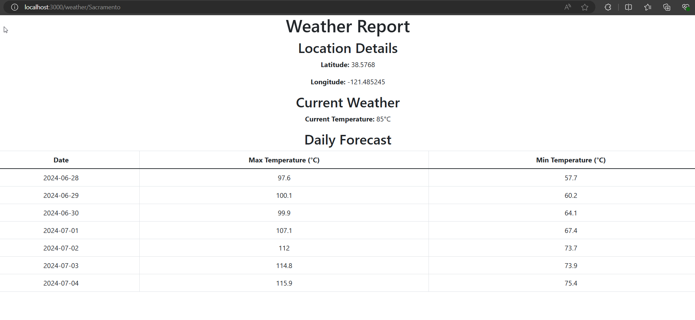

# CRWeather

CRWeather provides weather forecasts for specified locations. It utilizes the Open-Meteo API for fetching weather data and supports both geocoding to convert city names (or postal code) to latitude/longitude and direct latitude/longitude queries for weather information.

## Features

- Fetch weather forecasts including high and low temperatures for a 7-day period.
- Support for input via city names (or postal code) or direct latitude and longitude.
- Local storage of weather data using SQLite.
- RESTful API to interact with the weather service.
- Simple web interface to display weather information.

## Getting Started


### Installation

1. Clone the repository:

```sh
git clone https://github.com/marcelluseasley/crweather.git
cd crweather
```

2. Install the required Go modules

```sh
go mod tidy
```

3. Initialize the database

```sh
sqlite3 db/geo_weather.db < db/1_create_tables.sql
```

### Configuration

Ensure the following environment variables are exported:

```sh
export DB_PATH="/absolute/path/to/your/db/geo_weather.db",
export TMPL_PATH="/absolute/path/to/your/templates/weather.html"
```
### Running the Application

To start the server, navigate to the `cmd/weather` directory, build, and run:

```sh
go build
./weather
```

The server will start listening on port 3000.

### Usage

The application supports two main endpoints:

```sh
/weather/{input}: Fetch weather by city name or zip code

/weather/{lat}/{long}: Fetch weather by latitude and longitude
```


## Example Request

Navigate to one of these URLs in a web browser:
```sh
http://localhost:3000/weather/Orlando

http://localhost:3000/weather/28.550014/-81.380066

```

The browser should display the current weather and 7-day forecast.

